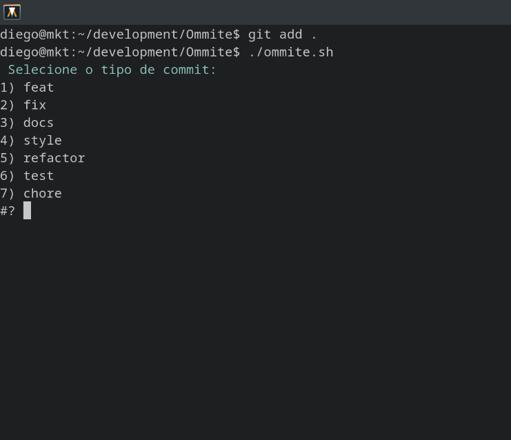

# Ommite

**Ommite** é uma ferramenta de linha de comando simples e interativa para padronizar mensagens de commit no Git, seguindo o estilo dos [Conventional Commits](https://www.conventionalcommits.org/).
---


---
## Instalação

Clone este repositório:

```bash
git clone https://github.com/diego5x/Ommite.git
cd Ommite
chmod +x ommite.sh
